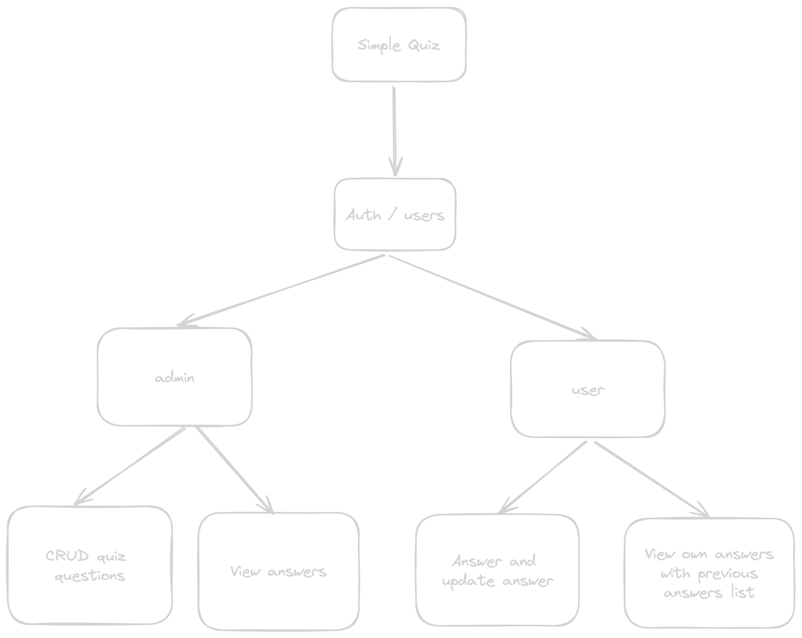

## Getting Started

"Simple Quiz" is a user-friendly application designed for both administrators and users to engage in a seamless quiz-taking experience. Administrators have the capability to effortlessly add, update, and delete questions, ensuring that the content remains fresh and relevant. They can also access a comprehensive overview of user answers for each question.

On the user side, individuals can participate in quizzes by answering questions presented to them. The application keeps track of their previous answers, allowing users to review their performance and track their progress over time. With its intuitive interface and robust functionality, "Simple Quiz" provides an enjoyable and educational platform for users to test their knowledge and learn new information.

## Developer Experience

- Nextjs + TypeScript
- TailwindCss + DaisyUI
- Zustand
- NextAuth

## Overview of the App



## Data Structure

```js
const question = {
    id: 1,
    question: 'How many legs does a spider have?',
    answers: {
      'username': {
        currentAnswer: 'eight',
        previousAnswers: ['Eight', '8'],
      }
    },
  },
```

## Mock User Credentials

You can find these credentials inside `db/users.ts` file.

```js
[
  {
    id: '1',
    username: 'admin',
    password: 'admin',
    role: 'admin',
  },
  {
    id: '2',
    username: 'user',
    password: 'user',
    role: 'user',
  },
  {
    id: '3',
    username: 'user2',
    password: 'user2',
    role: 'user',
  },
];
```

## Project setup for `Development`

1. Clone project on your local machine by running `git clone https://github.com/swimshahriar/simple-quiz.git`

2. Go to the project directory `simple-quiz` and execute

```bash
npm i
# or
yarn
```

3. Create a file called `.env.local` in the root directory and insert these environment variables:

```bash
NEXTAUTH_SECRET=anyTextHere
NEXTAUTH_URL=http://localhost:3000
```

4. Finally run `npm run dev` or `yarn dev` to start the dev server.
